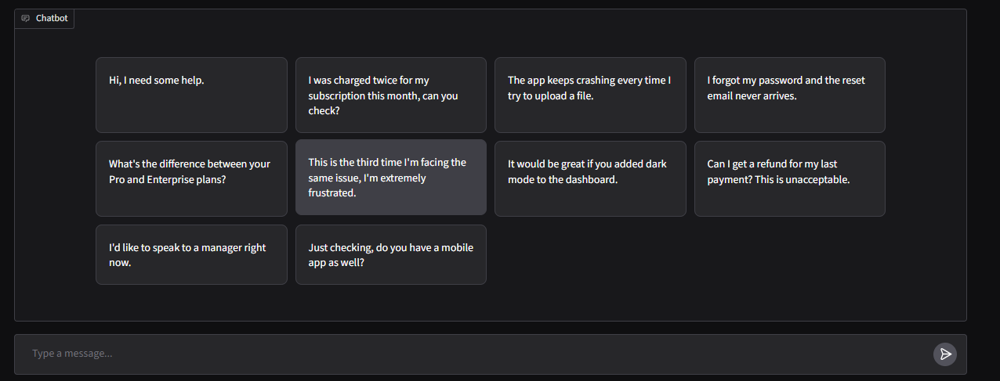

# AI Support Ticket Triage System

An AI-powered support ticket triage system that automatically classifies, prioritizes, routes, and drafts replies for incoming customer support messages — built with an **intent-based routing workflow** and support for **three interchangeable LLM providers**.

Businesses receive support tickets from email, chat, WhatsApp, forms, and helpdesk tools. Each one has to be read, categorized, prioritized, routed to the right team, and replied to professionally. Doing this manually is slow and inconsistent — this notebook automates that pipeline end-to-end using an LLM.

## What It Does

For every incoming customer message, the system:

1. **Classifies the ticket category** (e.g. billing, technical issue, complaint, feature request)
2. **Detects the priority level** (low / medium / high / urgent)
3. **Assigns the correct department** to handle it
4. **Generates a short internal issue summary** for the support agent
5. **Generates a professional, empathetic customer-facing reply**
6. **Decides whether the ticket needs human escalation**
7. **Remembers the conversation**, so follow-up messages on the same ticket are understood with full context

## How It Works

### Intent-Based Routing

The LLM first classifies the **category** (the "intent") of the ticket. Every other decision — priority, department, reply tone, escalation — is derived from that single classification, rather than being decided independently. This keeps the system's logic consistent and easy to reason about.

### Multi-Provider Support

The notebook works with **three interchangeable LLM providers** — **OpenAI**, **Groq** (free), and **Gemini** (free) — through one unified function:

```python
result = get_triage_response(provider="groq", ticket_id="ticket-001", user_message="...")
```

Switch providers with a single string parameter (`"openai"`, `"groq"`, or `"gemini"`) — no other code changes needed. All three providers return the same validated, structured result, even though each API handles structured output differently under the hood:

| Provider | Structured output method | Manual parsing needed? |
|---|---|---|
| **OpenAI** | `responses.parse(text_format=...)` — native | No |
| **Gemini** | `response_schema=...` — native | Yes (`model_validate_json`) |
| **Groq** | `response_format={"type": "json_object"}` + a plain-language schema instruction | Yes (`model_validate_json`) |

### Structured Output with Pydantic

Every provider's output is validated against one shared schema (`TicketTriageOutput`), which guarantees fields like `category` and `priority` can only ever be one of a fixed set of allowed values, and `confidence` is always a number between 0 and 1. This means the rest of the notebook never has to worry about malformed or unexpected data, regardless of which provider generated it.

### Conversation Memory

A conversation memory dictionary, keyed by `ticket_id`, stores the full back-and-forth for each ticket. When a customer sends a follow-up message, the model is given the entire prior conversation as context — not just the newest message in isolation — so it can respond coherently to ongoing issues.

### Safety-Net Escalation Rules

Beyond what the model decides on its own, the notebook applies independent Python-side rules to force escalation to a human agent when:
- The model's self-reported classification confidence is below a threshold
- The category is `complaint`
- The priority is `high` or `urgent`

This ensures escalation doesn't rely solely on the LLM correctly following every instruction in its system prompt.

## Project Structure

```
ai-support-ticket-triage/
├── README.md
└── AI_Support_Ticket_Triage_System.ipynb   # Full end-to-end notebook
```

Everything — schema, prompts, memory, provider calls, routing logic, console testing, and the Gradio UI — lives in this single notebook, organized into clearly labeled sections that run top to bottom.

## Notebook Sections

| Section | What it contains |
|---|---|
| Setup | Installs SDKs, loads API keys, initializes OpenAI/Groq/Gemini clients |
| Output Schema | `TicketTriageOutput` Pydantic model defining category, priority, department, summary, reply, escalation, and confidence |
| System Prompt | The business rules the model follows for classification, priority, routing, and tone |
| Conversation Memory | `conversation_memory` dict + `get_history()` / `update_history()` helpers |
| Input Builder | `build_input_messages()` — formats the conversation correctly for each provider |
| Provider Calls | `call_openai()`, `call_groq()`, `call_gemini()` — one function per provider |
| Unified Router | `get_triage_response()` — the single entry point that ties everything together |
| Console Demo | An interactive `input()`-based loop for manually testing tickets |
| Gradio Web UI | A chat-style web interface with a provider dropdown, ticket ID box, and example tickets |

## Setup

### Running in Google Colab (recommended, as written)

1. Open the notebook in Google Colab
2. In the left sidebar, click the 🔑 **Secrets** icon
3. Add secrets for whichever provider(s) you plan to use:
   - `OPENAI_API_KEY`
   - `GROQ_API_KEY`
   - `GEMINI_API_KEY`
4. Enable **Notebook access** for each secret
5. Run the cells from top to bottom

### Running locally (Jupyter)

1. Clone the repo:
   ```bash
   git clone https://github.com/<your-username>/ai-support-ticket-triage.git
   cd ai-support-ticket-triage
   ```

2. Install dependencies:
   ```bash
   pip install openai groq google-generativeai gradio pydantic
   ```

3. Set your API keys as environment variables:
   ```bash
   export OPENAI_API_KEY="sk-..."
   export GROQ_API_KEY="gsk_..."
   export GEMINI_API_KEY="..."
   ```

4. Replace the Colab-specific secret-loading cells (`from google.colab import userdata`) with plain `os.environ.get(...)` calls, since `userdata` is only available inside Colab.

5. Launch Jupyter and open the notebook:
   ```bash
   jupyter notebook AI_Support_Ticket_Triage_System.ipynb
   ```

## Usage

Once the setup cells have been run, you can either:

- **Use the console demo cell** — type customer messages directly and see the full triage breakdown (category, priority, department, summary, escalation flag, confidence, reply) printed for each one
- **Launch the Gradio UI cell** — get a chat-style web interface where you can pick a provider from a dropdown, set a ticket ID, and try example tickets
- **Call `get_triage_response()` directly** in any cell:
  ```python
  result = get_triage_response(
      provider="groq",
      ticket_id="ticket-001",
      user_message="I was charged twice for my subscription this month, can you check?",
  )

  print(result.category)           # billing_and_payments
  print(result.priority)           # medium
  print(result.department)         # billing_team
  print(result.escalate_to_human)  # True or False, depending on confidence/rules
  print(result.customer_reply)
  ```

## Output Schema

Every ticket is classified into the following structured schema:

| Field | Type | Description |
|---|---|---|
| `category` | enum | `billing_and_payments`, `technical_issue`, `account_access`, `product_inquiry`, `complaint`, `feature_request`, `general_query` |
| `priority` | enum | `low`, `medium`, `high`, `urgent` |
| `department` | enum | `billing_team`, `technical_support`, `account_management`, `sales_and_product`, `customer_success`, `general_support` |
| `issue_summary` | string | Short internal summary for the support agent |
| `customer_reply` | string | Professional, empathetic reply to the customer |
| `escalate_to_human` | bool | Whether a human agent must take over |
| `confidence` | float (0–1) | Model's self-reported confidence in the category classification |

## Demo

**Example ticket selection screen:**



**Example triage result — billing issue, escalated to a human:**


## Notes & Limitations

- This is a learning/demo project. The Gradio UI shows internal triage fields alongside the customer reply for transparency during testing; in a real deployment, only `customer_reply` would be shown to the customer, while the rest would go to an internal agent dashboard.
- Conversation memory is stored in-memory (a plain Python dictionary) inside the notebook's runtime and is lost when the kernel/session restarts. A production system would replace this with a persistent store (e.g. Redis or a database).
- The model's `confidence` score is a self-reported heuristic, not a calibrated probability — useful as a signal, not a guarantee.
- API keys are never hardcoded; they're read from Colab Secrets (or environment variables when run locally).

## License

MIT
